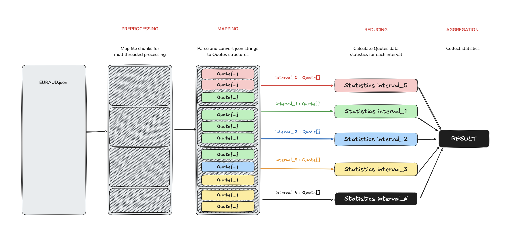

## Table of contents
*  [General info](#general-info)
*  [Under the hood architecture](#under-the-hood-architecture)
*  [System requirements](#system-requirements)
*  [Setup & Launch](#setup-launch)
*  [Contacts](#contacts)

## General info

This project is designed to process a MongoDB JSON dump containing forex quotes for a specific currency pair (EURAUD).
The program reads the input file and computes statistical metrics over 30-minute intervals for the bid and ask prices,
as well as their respective volumes.

This project follows a MapReduce-inspired approach to efficiently process large JSON dumps of forex quotes.
The architecture consists of four main stages, each designed for parallel execution,
ensuring optimal performance in a multithreaded environment.

## Under the hood architecture



1️⃣ Preprocessing – Splitting the File for Parallel Processing

The input JSON file is partitioned into multiple chunks for efficient parallel processing.
Each chunk is assigned to a separate Mapper thread, ensuring load distribution across CPU cores.

2️⃣ Mapping – Parsing and Time-based Partitioning

Mappers parse JSON strings and convert them into Quote structures.
Each Quote is assigned to a 30-minute time interval, ensuring structured organization for further computation.
Quotes are pushed into concurrent queues, categorized by their respective intervals.

3️⃣ Reducing – Computing Statistics for Each Interval

Each Reducer thread processes quotes from its assigned interval queue.
Statistical calculations (min, max, avg, median) are performed on bid/ask prices and volumes.
The computed statistics are stored for final aggregation.

4️⃣ Aggregation – Collecting and Finalizing Results

The statistics from all reducers are gathered into a final output (console or file).
This step ensures that all computed interval data is consolidated for reporting.

## System requirements
* Git
* Cmake version 3.31.0
* C++ 20
* Conan version 2.9.2


## Setup & Launch
``` bash
# 1) clone repo
https://github.com/AlexScherba16/itask

# 2) go to repo directory
cd itask

# 3) build application
make build

# 4) run application
make run

# 5) relax and enjoy 🤙
```

## Contacts
``` 
email:      alexscherba16@gmail.com
telegram:   @Alex_Scherba
```
